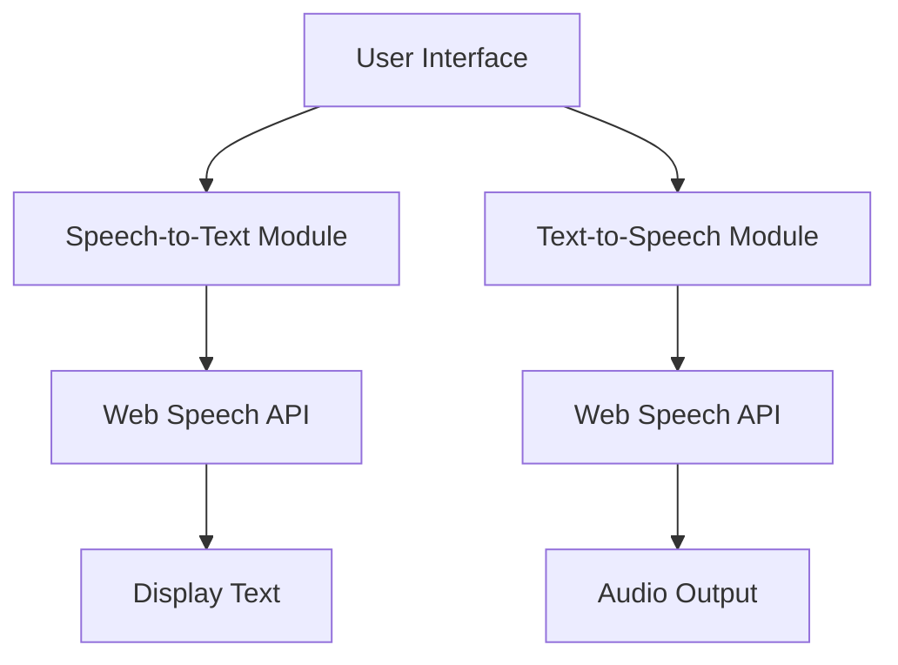

# iHear - Code Documentation

## Architecture Overview

iHear is built as a web application using HTML, CSS, and JavaScript. The application provides two main functionalities:

1. **Speech-to-Text (STT)**: Converts spoken Amharic to text using the Web Speech API
2. **Text-to-Speech (TTS)**: Converts text to speech using the Web Speech API

## Core Components

### 1. Speech-to-Text (STT)

The STT functionality is implemented using the Web Speech API's SpeechRecognition interface:

- `recognition` object handles speech recognition
- Language is set to Amharic
- Continuous recognition mode is enabled
- Interim results are displayed in real-time

Key functions:
- `startRecognition()`: Initializes and starts the speech recognition process
- `stopRecognition()`: Stops the ongoing recognition process
- Event handlers for processing recognition results and errors

### 2. Text-to-Speech (TTS)

The TTS functionality uses the Web Speech API's SpeechSynthesis interface:

- `speechSynthesis` object manages speech synthesis
- `SpeechSynthesisUtterance` creates speech requests
- Real-time speech synthesis as user types

Key functions:
- `speakText()`: Converts text to speech
- `stopSpeaking()`: Cancels ongoing speech synthesis
- `handleTextInput()`: Processes text input and triggers speech synthesis

### 3. UI Components

The UI is built with HTML, CSS, and JavaScript:

- Responsive design with Bootstrap
- Dark theme by default
- Gender selection for TTS voice
- Navigation bar with feature toggle
- Input/output panels for text

## File Structure

- `index.html`: Main entry point
- `speech.html`: Contains the STT and TTS functionality
- `css/`: Contains styling files
  - `style.css`: Main stylesheet
- `script.js`: Main JavaScript logic containing both STT and TTS functionality

## Dependencies

- Bootstrap: For responsive UI components
- Web Speech API: For speech recognition and synthesis
- Custom AMARIX model integration: For enhanced Amharic language processing

## Implementation Notes

- The application uses feature detection to ensure browser compatibility
- Error handling is implemented for cases where speech APIs are not supported
- Performance optimizations include debouncing for text input and limiting text length for TTS
- State tracking with flags like `isSpeaking` prevents overlapping speech synthesis calls 