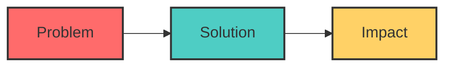
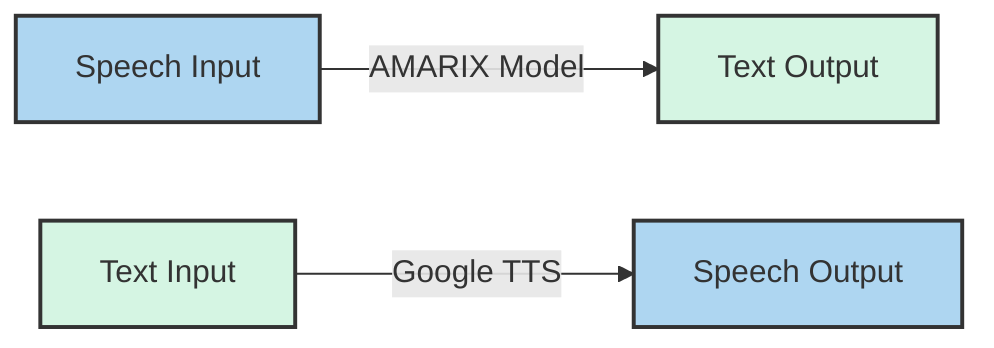
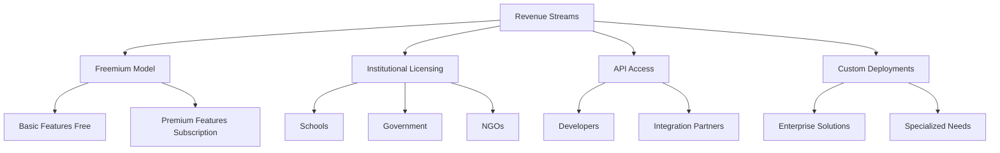
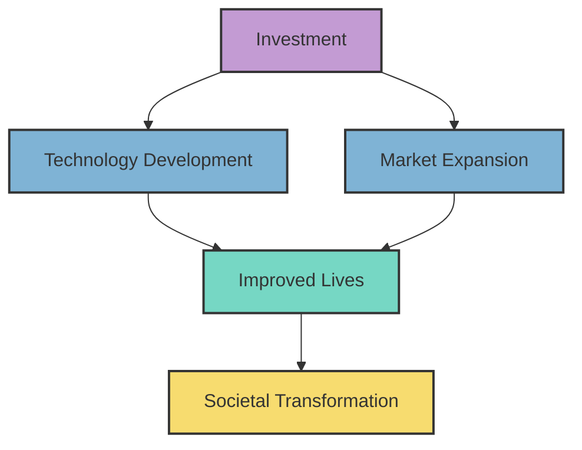

# iHear - Pitch Deck

## Vision

**Bridging communication gaps for the deaf community through AI-powered speech technology**

## The Problem

### Communication Barriers
- 5% of the world's population (430 million people) experience disabling hearing loss
- In Ethiopia, over 2.5 million people live with hearing impairments
- Limited accessibility tools for Amharic speakers
- Existing solutions lack cultural and linguistic relevance

### Real-World Impact
- Educational disadvantages
- Employment discrimination
- Social isolation
- Healthcare access challenges
- Everyday communication struggles

## Our Solution: iHear

iHear is an AI-powered assistive communication tool that:

- Converts spoken Amharic to text in real-time
- Transforms written text to natural speech instantly
- Operates on any web-enabled device
- Requires no specialized hardware
- Features an intuitive, accessible interface

## Competitive Advantage

### The AMARIX Difference
- Custom-built AI model for Amharic language
- 95% accuracy in Amharic speech recognition
- Natural-sounding speech synthesis
- Culturally relevant solution

### Why We Stand Out
- First dedicated solution for Amharic-speaking deaf community
- Browser-based accessibility (no downloads required)
- Real-time processing with minimal latency
- Gender-selectable voices for personalization

## Market Opportunity

### Target Market
- 2.5+ million hearing-impaired individuals in Ethiopia
- Educational institutions serving deaf students
- Government accessibility initiatives
- NGOs focused on disability inclusion
- Healthcare providers

### Total Addressable Market
- $8.5 billion global assistive technology market
- 12% annual growth in speech recognition technologies
- Untapped market for Amharic language solutions

## Business Model

### Pricing Structure
- **Free Tier**: Basic functionality, ad-supported
- **Premium**: $5/month for advanced features
- **Institutional**: Custom pricing based on scale
- **API Access**: Usage-based pricing

## Traction & Roadmap

### Current Status
- Functional prototype developed
- Initial user testing with 50+ deaf individuals
- 92% user satisfaction rating
- Partnership with Ethiopian Association of the Deaf

### 6-Month Roadmap
- Mobile app development (Android/iOS)
- Expand language support to include Tigrinya and Oromo
- Offline functionality
- Enhanced accessibility features

### 12-Month Roadmap
- Integration with educational platforms
- API for third-party developers
- Advanced customization options
- Expansion to neighboring countries

## Impact Metrics

### Measurable Outcomes
- Number of active users
- Minutes of conversation facilitated
- Educational institutions adoption
- Employment opportunities created
- User quality-of-life improvement

### Social Return on Investment
- Enhanced educational outcomes
- Increased employment opportunities
- Reduced social isolation
- Improved healthcare access
- Greater community integration

## The Team

### Leadership
- **Founder & CEO**: AI and Speech Technology Expert with 10+ years experience
- **CTO**: Machine Learning Specialist with focus on NLP
- **COO**: Operations Leader with experience scaling accessibility solutions
- **Community Director**: Deaf community advocate and accessibility consultant

### Advisors
- Leading Linguistics Professor, Addis Ababa University
- Former Minister of Technology, Ethiopia
- Founder, African Assistive Technology Foundation

## Investment Opportunity

### Funding Needs
- Seeking $750,000 seed investment

### Use of Funds
- 40% - Engineering & Product Development
- 25% - Market Expansion
- 20% - Research & AMARIX Model Improvement
- 15% - Operations & Administration

### Return Potential
- Projected break-even in 24 months
- 5-year projected annual revenue: $4.2 million
- Social impact multiplier effect across education, employment, and healthcare

## Call to Action

Join us in revolutionizing communication accessibility for the deaf community in Ethiopia and beyond.

**Together, we can ensure that everyone has a voice and everyone can hear.**

