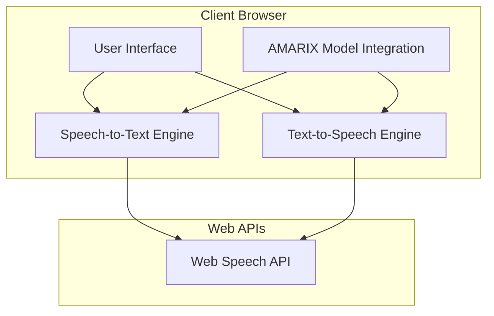
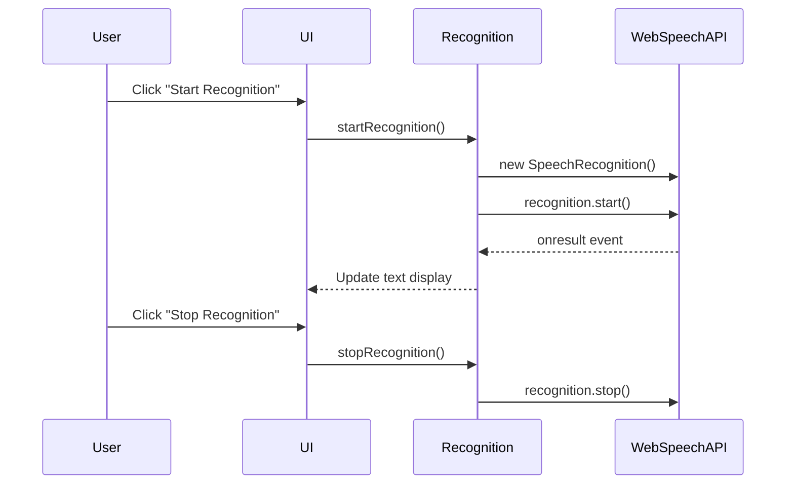
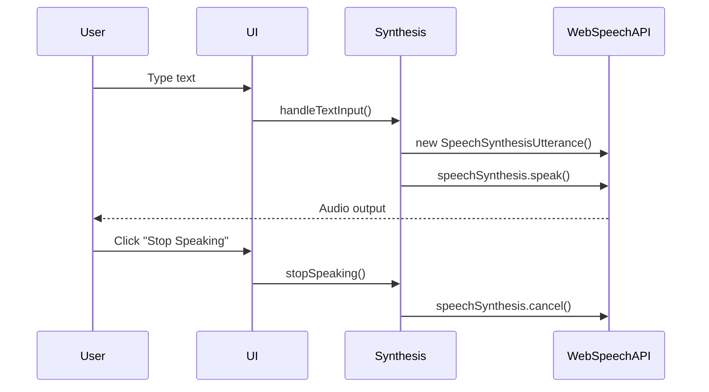

# iHear - Technical Documentation

## System Architecture

iHear is a web-based assistive communication tool designed for the deaf community, with a focus on Amharic language support. The system architecture follows a client-side approach with browser-based speech processing.

## Technical Requirements

### Minimum System Requirements
- Modern web browser with Web Speech API support (Chrome, Edge, Firefox)
- Internet connection for initial loading
- Audio input device (microphone) for STT
- Audio output device (speakers) for TTS
- 4GB RAM recommended
- Processor: 1.6 GHz or faster

### Browser Compatibility
- Chrome (version 33+)
- Edge (version 79+)
- Firefox (version 49+) with flags enabled
- Safari (limited support)

## Implementation Details

### Speech-to-Text Implementation

The Speech-to-Text functionality leverages the Web Speech API's SpeechRecognition interface:

Key technical aspects:
- Recognition language set to Amharic
- Continuous recognition mode enabled
- Real-time interim results display
- Error handling for unsupported browsers

### Text-to-Speech Implementation

The Text-to-Speech functionality uses the Web Speech API's SpeechSynthesis interface:

Key technical aspects:
- Real-time speech synthesis as user types
- Voice gender selection
- Performance optimization with debouncing
- State tracking to prevent overlapping speech calls

### AMARIX Model Integration

The custom AMARIX model enhances the application's ability to process Amharic language:

- Improved recognition accuracy for Amharic speech patterns
- Enhanced text-to-speech synthesis for natural-sounding Amharic
- Transliteration capabilities between Amharic and Latin scripts

## Performance Considerations

- **Text Length Limiting**: TTS performance is optimized by limiting text length
- **Debouncing**: Input handling is debounced to prevent excessive API calls
- **State Management**: Proper tracking of speech states prevents resource conflicts
- **Error Recovery**: The application implements graceful degradation when API calls fail

## Security Considerations

- The application runs entirely client-side, minimizing data exposure
- No speech data is stored permanently
- Microphone access requires explicit user permission
- No external API dependencies beyond the browser's built-in capabilities

## Future Technical Enhancements

- Offline support via Progressive Web App (PWA) capabilities
- Enhanced voice customization options
- Integration with additional assistive technologies
- Mobile application versions for iOS and Android 