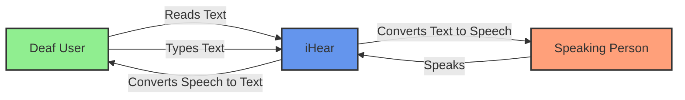
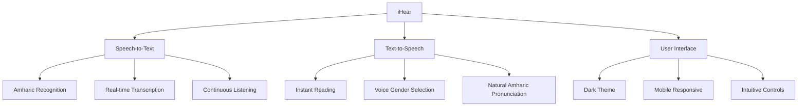
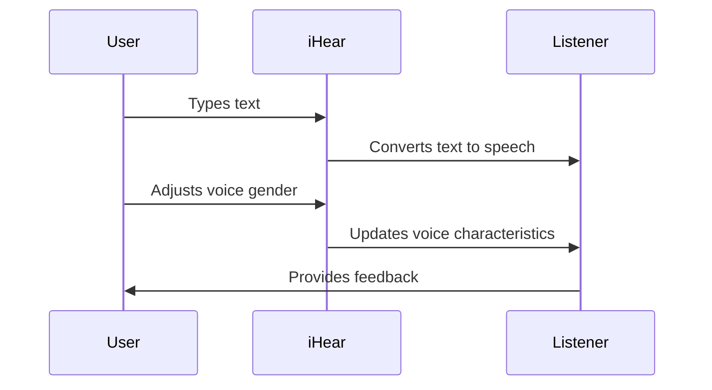

# iHear - User Documentation

## Introduction

iHear is an AI-powered assistive communication tool designed specifically for the deaf community to bridge the communication gap. Powered by our custom AMARIX model and Google TTS, iHear enables seamless speech-to-text and text-to-speech conversion with a focus on Amharic language support.

## Getting Started

### System Requirements
- A modern web browser (Google Chrome recommended)
- Internet connection
- Microphone for speech input
- Speakers for audio output

### Accessing iHear
1. Open your web browser
2. Navigate to the iHear application URL
3. Grant microphone permissions when prompted

## Features Overview

## Using Speech-to-Text

The Speech-to-Text feature allows you to convert spoken Amharic into written text.

### How to Use Speech-to-Text:

1. Click on the "Speech-to-Text" tab in the navigation bar
2. Press the "Start Recognition" button
3. Speak clearly into your microphone
4. Watch as your speech is converted to text in real-time
5. Press "Stop Recognition" when finished

### Tips for Better Recognition:
- Speak at a moderate pace
- Use a quiet environment
- Position yourself 6-12 inches from the microphone
- Speak clearly and pronounce words distinctly

## Using Text-to-Speech

The Text-to-Speech feature converts written text into spoken words, allowing deaf users to communicate with hearing individuals.

### How to Use Text-to-Speech:

1. Click on the "Text-to-Speech" tab in the navigation bar
2. Type your message in the text input area
3. The system will automatically read the text as you type
4. Use the gender toggle to select male or female voice
5. Click "Stop Speaking" if you need to interrupt the speech

## Troubleshooting

### Common Issues and Solutions:

**Microphone Not Working**
- Ensure your browser has permission to access your microphone
- Check if your microphone is properly connected
- Try refreshing the page

**Speech Recognition Not Accurate**
- Speak more clearly and at a moderate pace
- Reduce background noise
- Position yourself closer to the microphone

**Text-to-Speech Not Working**
- Ensure your device volume is turned up
- Check if your browser supports the Web Speech API
- Try using Google Chrome for best compatibility

## Accessibility Features

iHear is designed with accessibility in mind:

- Dark theme for reduced eye strain
- Responsive design for use on various devices
- Simple, intuitive interface
- Real-time feedback
- Gender-selectable voices

## Privacy and Data Security

iHear respects your privacy:

- No speech or text data is permanently stored
- All processing happens in your browser
- No account creation required
- No personal information collected

## About AMARIX

AMARIX is our custom AI model specifically developed for Amharic language processing. It enhances the accuracy of speech recognition and the naturalness of speech synthesis for Amharic speakers, making iHear a powerful tool for the Ethiopian deaf community. 